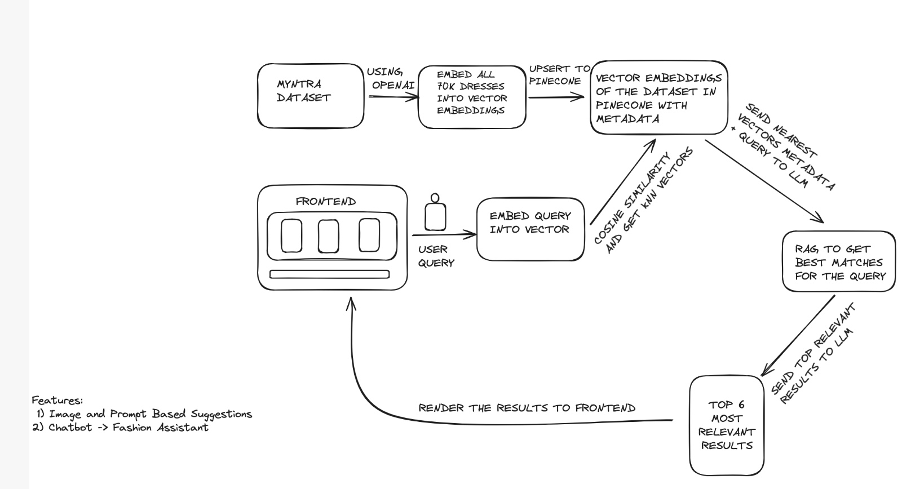
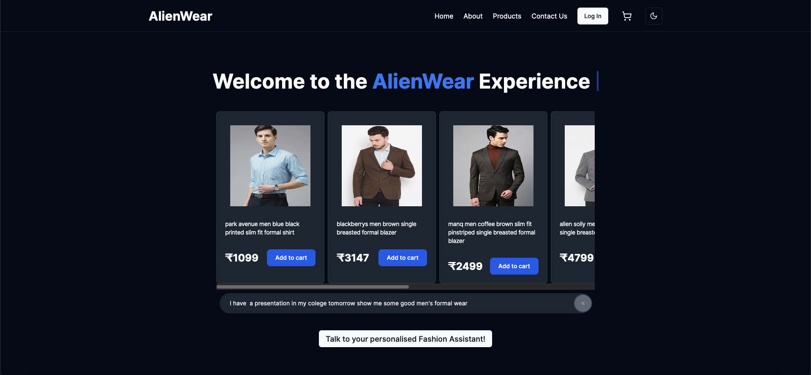
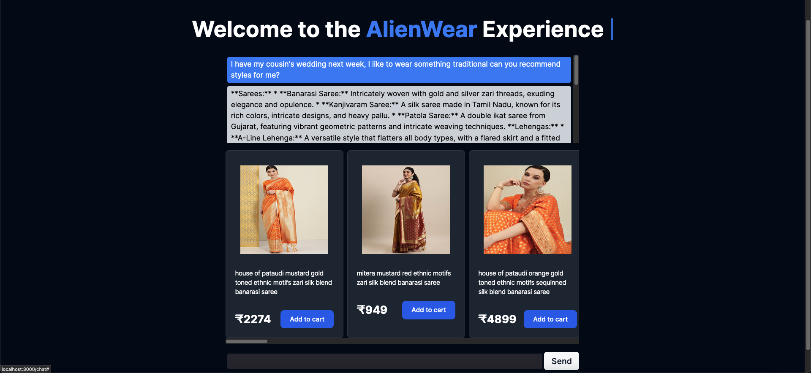
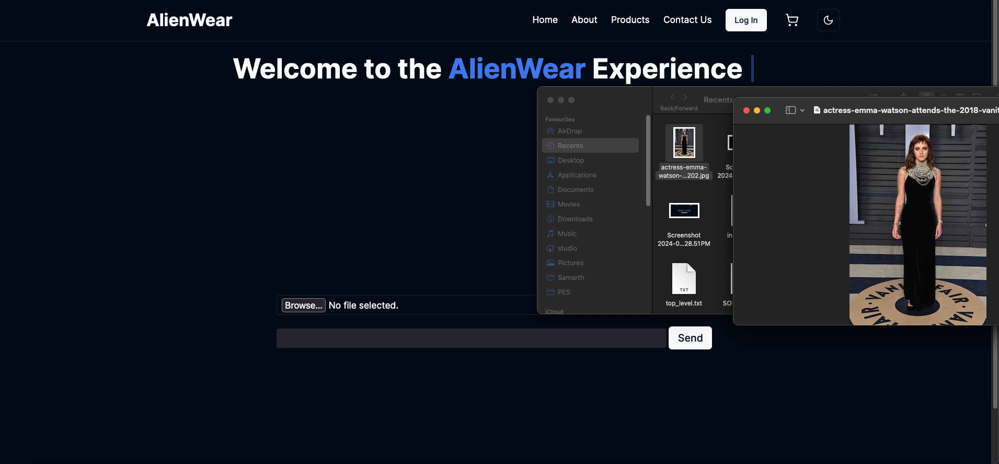
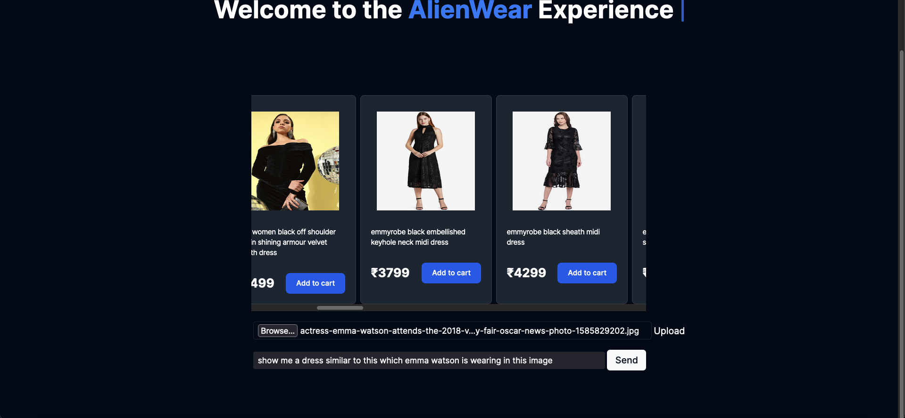

# AlienWear

AlienWear an AI-powered fashion e-commerce platform that leverages vector search to provide semantic search capabilities. Users can use natural language to get search results, enhancing the overall user experience and making product discovery more intuitive.

## Technology Stack

- **Frontend**: NextJS
- **Backend**: Flask
- **Vector Database**: Pinecone
- **Embedding Vectors**: OpenAI ada-002
- **Dataset**: Myntra Dataset from Kaggle
- **LLM for RAG**: Gemini
- **UI**: Shadcn

## Architecture



## Features

### Semantic Search

Our platform uses vector search to provide a more intuitive and user-friendly search experience. Unlike traditional keyword-based search, vector search understands the semantic meaning behind the user's query, providing more relevant and accurate results. This is made possible by embedding vectors using OpenAI's ada-002 and Cosine-Similarity search for nearest vectors in Pinecone.

### Image Search

Users can upload an image of a dress and the platform will search for similar dresses. This feature uses image recognition and vector search to find dresses that are visually similar to the uploaded image.

### Personal AI Fashion Guide

Our platform features a personal AI fashion guide that provides personalized fashion advice and recommendations. The users can then search for the recommended styles using th generate suggestions button.


## Screenshots








## Setup and Installation

To set up and install Alienwear, follow these steps:

1. **Clone the Repository**: Use Git to clone the repository to your local machine.
   ```
   git clone https://github.com/samarth777/alienwear.git
   ```
2. **Install Dependencies**: Navigate to the project directory and install the necessary dependencies for both the frontend and backend.
   - For the frontend (NextJS):
     ```
     cd frontend/ingenius-frontend
     npm install
     ```
   - For the backend (Flask):
     ```
     cd backend
     pip install -r requirements.txt
     ```
3. **Set Up Environment Variables**: Create a `.env` file in the backend directory and add the necessary environment variables, such as database credentials and API keys.
4. **Run the Backend**: Start the Flask server.
   ```
   python main.py
   ```
5. **Run the Frontend**: In a separate terminal, navigate to the frontend directory and start the NextJS development server.
   ```
   cd frontend
   npm run dev
   ```
6. **Database Setup**: Ensure Pinecone is set up and configured according to the instructions provided in their documentation.

## Usage

1. **Navigate to the Homepage**: Open your web browser and go to the local or deployed URL of the platform.
2. **Search for Products**: Use the search bar to enter queries. Try using natural language queries to see the semantic search in action.
3. **Upload an Image**: To use the image search feature, click on the "Upload Image" button and select an image of a dress. The platform will find similar dresses.
4. **Access Your Personal AI Fashion Guide**: Navigate to the "My AI Fashion Guide" section to see personalized recommendations.


